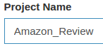
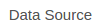
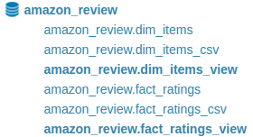

# Analyze Amazon Reviews with Apache Kylin


### Abstract
On [_Playing with 80 Million Amazon Product Review Ratings Using Apache Spark_](https://github.com/adam-p/markdown-here/wiki/Markdown-Cheatsheet), Max Woolf, Uses Apache Spark with Python and R to analyze an Amazon dataset. 

We will use [Apache Kylin](http://kylin.apache.org/) and [Tableau](https://www.tableau.com/) to easily generate reports ad-hoc and see the response time of them.

<p align="center">
  
</p>

### Required software & hardware
Software used: 
* Kylin 1.6 or superior, [download](http://kylin.apache.org/download/).
* BI Tool, you can choose your own tool, in this case Tableau Desktop is used, [download](https://www.tableau.com/products/desktop/download).
* Optional, If you do not have access to a Hadoop Cluster, Docker is a good solution to mount a Hadoop system (I use it and it works with no problem), [download](https://www.docker.com/community-edition).

To clone this repository: 
```
cd ~ &&
mkdir kylin &&
cd kylin  &&
git init &&
git remote add -f origin https://github.com/albertoRamon/Kylin &&
git config core.sparseCheckout true &&
echo "KylinAmazon/" >> .git/info/sparse-checkout &&
git pull origin master 
```

### About Amazon ratings dataset
[Download Page](http://jmcauley.ucsd.edu/data/amazon/)
This dataset provides two types of files:
* Review files: After a purchase the customer has the opportunity to evaluate the product, from 1 to 5 starts and to leave a comment as well.
* Metadata file: It's a full description of one product: Name, Brand, Picture, category....

These files are related by _asin_ unique identifier for each Amazon Product.

We use these two files:
* Metadata: Is a compressed json in gz with 9.4 Million products (size: 3.4 GB / 10.5 GB).
* Ratings only: Is an uncompressed CSV file with 82.6 Million of evaluations.

Download it and store it as it is (without decompressing) in _DataDownloaded_ folder, as is:
<p align="center">
  
</p>

**Note1**: To download some big files you will need to write an email for a request.

**Note2**: Ratings file be replaced by one of the smaller files from the "subset" section.

### Prepare dataset
We need to prepare the two original files to be ingested into Hive tables. In order to get this done, execute the python scripts.
```
python processItem.py
python processMetadata.py
```
As a result you will have two new files in the _DataProcesed_ folder, as is:
<p align="center">
  
</p>

### Copy data to Hive and create tables 
**If you are using Docker:**

Edit _Scripts/01-ImportData.sh_ and particularize ID Docker Image.
```
ContainerID='58b'
```
Execute this scripts: Copy the data to Docker Container and create tables on Hive.
```
./Scripts/01-ImportData.sh
```

**If you are NOT using Docker:**

Copy manually the data in  _DataProcesed_ to your cluster gateway
Edit _Scripts/02-CreateTB.sql_ and particularize the path
```
set hivevar:PathFiles=/Amazon_Review;
```
Connec to your cluster and execute:
```
hive -f 02-CreateTB.sql
```

## Build Cube
**1 -Create New project:**

Click on  and put a name 

**2 -Import the data source:**

Click on  & , select the tables to import (hold _ctrl_ to select more than one) 

**3 -Create Data Model:**

Click  & 

Specify fact table: 
<p align="center">
  
</p>

Specify dim table:
<p align="center">
  
</p>

Specify dimensions columns:
<p align="center">
  
</p>

Specify measures columns:
<p align="center">
  
</p>

**4 -Define Cube:**

Clink on 

Select the data model previously defined  _Amazon_Review_
<p align="center">
  
</p>

Define 2 dimensions as _normal_:
<p align="center">
  
</p>

Define the measures: 
<p align="center">
  
</p>

In _Configuration Overwrites_:
<p align="center">
  
</p>

To launch the build:  > 

To process the 80 Millions of rows we used **30 minutes** in a laptop:
<p align="center">
  
</p>


### Connect to cube with BI tool
We used Tableau to generate reports of our new cube:
<p align="center">
  
</p>

<p align="center">
  
</p>

