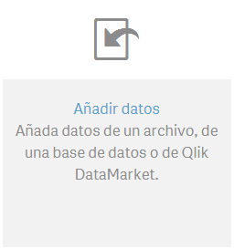
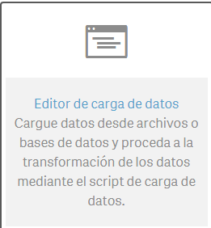
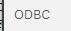

# Connect from Qlik

**Date:** September 2016

**Author:** Ramón Portolés, Alberto    [Linkedin](https://www.linkedin.com/in/alberto-ramon-portoles-a02b523b "My Linkedin") 

&nbsp;
&nbsp;
### Intro
It’s a new player in the BI tools world, with a high growth since 2013

[On-line demos](http://eu-a.demo.qlik.com/)

Nowadays has connectors for Hadoop Databases: [Hive](https://hive.apache.org/index.html) and [Impala](http://impala.apache.org/)

But it doesn’t have Kylin a connector

&nbsp;
&nbsp;

### Used Software:
* [Apache Kylin](http://kylin.apache.org/) v1.5.2
* [Kylin ODBC](http://kylin.apache.org/docs15/tutorial/odbc.html "Download")  v1.5
* [Qlik Descktop](http://www.qlik.com/us/try-or-buy/download-qlikview) v3.0.2.0

&nbsp;
&nbsp;

### Pre-requisites
A. An instance of Kylin with a cube: [Quick Start with Sample Cube](http://kylin.apache.org/docs15/tutorial/kylin_sample.html) will be enough

Can be checked it by looking the name of the cube: 

  

B. Download, Install and configure Kylin ODBC Driver
  1. [Install Kylin ODBC](http://kylin.apache.org/docs15/tutorial/odbc.html)
  2. Add DNS System in Windows

  

  3. Configure: User-name /Password: ADMIN / KYLIN

  

  4. Click Connect and Choose the project

  

&nbsp;&nbsp;&nbsp;Click on “Done”
&nbsp;
&nbsp;

### Install Qlik:
Requires: [(System Requeriments)](https://help.qlik.com/en-US/sense/1.1/Subsystems/Desktop/Content/Introduction/InstallingDesktop.htm)
* Windows 7 SP1 (64 bit) or 8.1 (64 bits)

  Be careful with 64 bits and SP1, its mandatory

  Has been tested it on Windows 2012 and didn’t work
* Framework .Net 4.5.2
* 1.5 GB of free Disk Space

Note: The Language of Qlik Desktop is the same as your S.O. (cann't be changed)

My apologies for some pictures in Spanish language  ;)

&nbsp;

Launch the process **as Admin**:

  

  

  

&nbsp;

**Issue 1:**  The Burn engine cannot run with an MBA under the .NET 4
(The [Qlik Forum](https://community.qlik.com/thread/158165) and msg txt wrongly suggests that the problem is about .NET)

In the log you will see:

    : Error 0x81f403e8: The Burn engine cannot run with an MBA under the .NET 4 CLR on Windows 7 RTM with .NET 4.5.2 (or greater) installed.
    [0070:0A8C][2016-09-09T22:34:33]i000: Loading prerequisite bootstrapper application because managed host could not be loaded, error: 0x81f403e8.
    [0070:0BC0][2016-09-09T22:34:33]i000: Setting numeric variable 'WixStdBALanguageId' to value 3082

Solution: Qlik requires SP1 of Windows 7 to install  ( this info Isn’t in the [Official System Requeriments](https://help.qlik.com/en-US/sense/1.1/Subsystems/Desktop/Content/Introduction/InstallingDesktop.htm))

[Download & Install SP1 64 bits](https://support.microsoft.com/en-us/help/15090/windows-7-install-service-pack-1-sp1)
&nbsp;

**Issue2:** Microsoft .Net framework is required for Qlik Sense desktop setup

  

And you **don’t have** a button “Accept and install”

I tried Qlik [Community 1](https://community.qlik.com/thread/127287) and [Qlik Community 2](https://community.qlikview.com/thread/184710) , but didn’t work

Solution: delete in windows registry all references to Qlik

&nbsp;
&nbsp;

## Create New App
Open Qlik Desktop 

Create New App, With name Kylin 

Now, the complex part is to import your Kylin data into Qlik

 The failures has been documented because they are also important

&nbsp;
### Attempt 1: To add Data (fail)
>  > > 

The login and password can be empty 

See the Kylin’s tables: 

  

Problem: The load **never finishes** (I've Waited 20 minutes)

See *"Issue 1: Qlik Metadata"*

&nbsp;

### Attempt 2: Add Data (fail)
  >  >  >  >  

The login and password can be empty 

An click on: 

Problem: The load **never finished**

See *"Issue 1: Qlik Metadata"*

&nbsp;
### Attempt 3: Add Data (successful)
Configure our own data loader using a script needed

Some configuration parameters from the connector created in *"Attempt 2: Add Data (fail)"* should be changed

Activate debug mode: 

And test the default script with  ,  The execution is execution step by step

&nbsp;
List of changes:
* Change Dates format to YYYY-MM-DD

  

* Add Connection String: You can add it directly with 

  

* Load columns & data from tables

&nbsp;
First, test the query using Kylin UI:

  

The result is: (731 rows) 

  

(Note: use  to copy the name of the columns)

The result must be similar to:  (See “[script_data_1.txt](script_data_1.txt)”, on gitHub)

  

Test the import script:
 
* Save Script: 

* Out of debug mode: 

* Now, “Load data” button must be enabled: 

The Output must be similar to: (check that the row count is the same as in the Kylin UI)

  

To Import other table (fact table) only need to add:

    LOAD PART_DT,LEAF_CATEG_ID,LSTG_SITE_ID,LSTG_FORMAT_NAME,PRICE,
    SELLER_ID,MIN_PRICE_,MAX_PRICE_,COUNT__, COUNT_DISTINCT_SELLER_ID_,
    COUNT_DISTINCT_LSTG_FORMAT_NAME_;
    select * from KYLIN_SALES;

Data can be selected under an “alias”:

    [CAL_DT]:
    LOAD WEEK_BEG_DT,CAL_DT;
    select * from KYLIN_CAL_DT;

The final load scripts are in“[script_data_2.txt](script_data_2.txt)”, on gitHub

Used hardware: a Laptop with HBase, Kylin, Hive .. inside a Docker Container, and Qlik is inside a Virtual Box, the performance to ingest data has been good, only 2 sec for 3 Tables and 10K Rows

  

See all ingested tables in “[data manager](https://help.qlik.com/en-US/sense/3.0/Subsystems/Hub/Content/LoadData/data-management.htm)”:   > 

  

NOTE: If you try to see data of one table: Click in one,  **you aren’t able to  see data from one table** (below)

   “Data tables defined in the load script are not managed in Data manager”

  

  

&nbsp;
**Issue 1:** Qlik Metadata
The log of ODBC kylin are in: 

When use Attempt 1 and 2 are used, see some errors can be showed: **SQLGetInfoW**

  

&nbsp;
## Define Table associations
([Managing data associations](https://help.qlik.com/en-US/sense/3.0/Subsystems/Hub/Content/LoadData/associating-data.htm))

You can see the actual table associations in:

  

But this association isn’t correct, see the correct ones  in Kylin UI > Model designer > Data Model:

  

How can be changed?:

  In “data manager”:   >   >  

  In true, it can’t changed because

  “*Data tables defined in the load script are not managed in Data manage*r”

&nbsp;
## Create dataSheets
There is only one way to add data from load script into a sheet:
In “data manager”:   >   >   > Edit Sheet

You can see all Columns in:  , can be classified like  Dim or measures with Right click

Also, define a Hierarchy in Dim:

  

First, add graphic elements from:  (Drag and drop)

Second: Add Dim and Measures (Drag and drop)

  

View the result from main menu:

  

  

&nbsp;

## Future Work
* Load data using “**load script**” is a workaround to read data from Apache Kylin, but like the data isnt’t controlled by **Data Manage**r you can’t use the preview of data ([manual  reference](https://help.qlik.com/en-US/sense/3.0/Subsystems/Hub/Content/LoadData/data-management.htm)) ([Qlik Community](https://community.qlik.com/thread/206922))
* Same problem with “**associations**”, can’t be managed/changed them because this data isn’t managed  by **Data Manager**

This problems means that if the automatic associations aren’t correct, **the data results will be false**

&nbsp;
&nbsp;

**For any suggestions, feel free to contact me**

**Thanks, Alberto**

