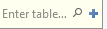
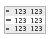
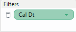
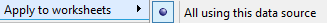
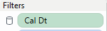
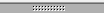
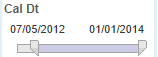
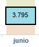

# Use Tableau with Apache Kylin
**Date:** August 2016

**Author:** Ramón Portolés, Alberto     [Linkedin](https://www.linkedin.com/in/alberto-ramon-portoles-a02b523b "My Linkedin")  		

## Intro
We can use [Quick Start with Sample Cube ](http://kylin.apache.org/docs15/tutorial/kylin_sample.html "Build Instructions") of Kylin Project to make an example of integration with Tableau Software

  

&nbsp;
&nbsp;
## Pre-requisites
The First, you need Build Kylin Cube: [Quick Start with Sample Cube](http://kylin.apache.org/docs15/tutorial/kylin_sample.html "Build Instructions"): With Step 5, you can check the result cube Executing:

&nbsp;&nbsp;&nbsp;*select part_dt, sum(price) as total_selled, count(distinct seller_id) as sellers from kylin_sales group by part_dt order by part_dt*

  

&nbsp;

Second, Install [Tableau Desktop 9.3.3](http://www.tableau.com/products/desktop/download "Download") On Windows

&nbsp;
&nbsp;
## Used Software
+ [Kylin: 1.5.2](http://kylin.apache.org/download/ "Download")
+ [Kylin ODBC 1.5](http://kylin.apache.org/docs15/tutorial/odbc.html "Download") (Don’t use v1.3, don’t work)
+ [Tableau Desktop 9.3.3](http://www.tableau.com/products/desktop/download "Download")

&nbsp;
&nbsp;
## Create Connection
1. [Install Kylin ODBC](http://kylin.apache.org/docs15/tutorial/odbc.html "Install")

2. Add DNS System in Windows

  

3. And configure: User-name /Password: **ADMIN / KYLIN**

  

4. Click Connect and Choose the project

  

5. Click on “Done”

6. Download and install Tableu Desktop  and launch it

7.  >  > 

8.  > 

9. Complete details connections (ADMIN /KYLIN), click done, click OK:

  

10. Click on  >  >  (In **magnifying glass**)

 &nbsp;&nbsp;&nbsp;&nbsp;&nbsp;&nbsp; The result must be, three new tables (on left panel):

  

 &nbsp;&nbsp;&nbsp;&nbsp;&nbsp;&nbsp; NOTE: Sometimes it doesn’t work fine,, Solution: close and open Tableau  :)

11. Add this tables to Tableau: Drag and Drop to 

* First “Kylin_sales” (Fact Table) and second “Kylin_Cal_DT” (Dimension table)

  

&nbsp;&nbsp;&nbsp;&nbsp;&nbsp;&nbsp; And Join Relation:

  

* Now the same with “Kylin_Category_Groupings”

  

* The result must be:

  

* Now if you click: , you must see data table:

  

&nbsp;
&nbsp;
## Intro to Sheet Elements
Go to Sheet 1: 
You must see the Dimensions in left panel

  

And measures:

  

&nbsp;
&nbsp;
## Our First WorkSheet
Drag and Drop “Cal_Dt” and “Price” like in picture:

  

You can expand to Quarter and Months: Click on “Plus” of year: 

  

We can add sub-totals  by category: Drag and Drop “Meta Categ Name” to “Color”

  

The result must be similar to:

  

&nbsp;
&nbsp;
## Second Worksheet
Create new Worksheet 
Drag and Drop:

  

After than we can see the relations between  “Meta Categ Name”,  "L2" and "L3":

  

Delete 3 the three fields in “Rows” and generate a hierarchy:  using Dimensions Menu (Left side) Drag and Drop “Lvl2” over “Meta Categ Name” and after D & Drop “Lvl3”, the result must be:

  

Drag and Drop the New hierarchy on “Rows” and expands

  

Change the diagram type to table: 

Drag and Drop “Price” to Rows, and see total at right of table:

  

Now you can change the graph type:

  

&nbsp;
&nbsp;
## Create Dashboard
Create New Dashboard 

Drag and Drop WorkSheet_1 and WorkSheet_2

  

## Add filter to dashboard
1º Add Filter to Worksheet_1 : 

2º Configure the filter like “All Using this Data Source” 

3º Then check the Worksheet_2 and we will see a new filter has been append: 

4º Add filter to dashboard: Select a Worksheet on Dashboard, and right- click on upper edge 

Filter > “Cal Dt”

  

&nbsp;

After that  a new right panel will appear:  ,this filter will be affect on all Dashboard’s Worksheet

Furthermore, you can filter by date, clicking in month, on upper worksheet 

&nbsp;
Or, you can filter by category, clicking in category too 

&nbsp;
&nbsp;
## Final Result:

  

&nbsp;
&nbsp;

**__For any suggestions, feel free to contact me__**

**__Thanks, Alberto__**

