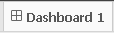

# Connect our Tableau to URL Cube

**Date:** Jun 2017

### Intro
Connec to Tableau to [Sample Cube](http://kylin.apache.org/docs15/tutorial/kylin_sample.html "Build Instructions") build and exposed as service (Rest API) in [this URL](http://kapdemo.chinaeast.cloudapp.chinacloudapi.cn:8080/)

### Pre-requisites
* Install [Tableau Desktop](http://www.tableau.com/products/desktop/download "Download") on Windows
* Internet connection

### Connect Tableau with remote cube
1. [Install Kylin ODBC](http://kylin.apache.org/docs15/tutorial/odbc.html "Install")

2. Add DNS System in Windows and configure as the picture

   Use login password: _analyst / analyst_

   Click connect and select _learn_kylin_ project

   Click done to save the connection

  

3. Download Tableau file ([Full.twb](https://github.com/albertoRamon/Kylin/blob/master/KylinWithTableau/Full.twb "Download Full Example")) from [GIT](https://github.com/albertoRamon/Kylin/tree/master/KylinWithTableau) 

### Use Tableau
1. Open _Full.twb_ file

  

2. Click _Edit connection_: Choose DNS type and _RemoteCube_ and connect

  

3. Bellow choose 

4. The dashboard is **ready to use it!:**

  

